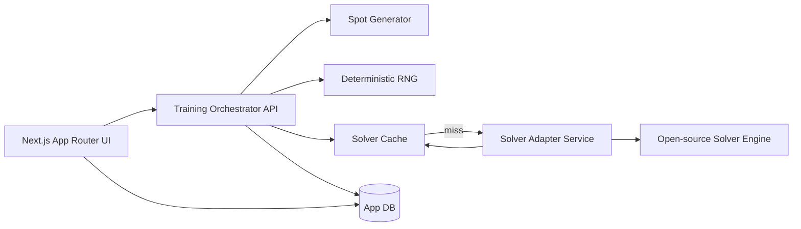

# ev-drill-trainer — Technical Design

Created: 2026-01-27T22:31:07Z  
Updated: 2026-01-27T22:31:07Z  
Phase: Design Generated (pending approval)

## 1. Overview
This document defines the architecture and interfaces for the EV-first poker drill trainer. The system delivers multiple training modes, grades every user action by EV loss versus solver baselines, samples opponent actions from solver mixed strategies with deterministic RNG, and caches solver outputs by canonical node hash.

## 2. Goals and Non-Goals
### Goals
- Deliver Spot Quiz, Hand Play, Review/Mistakes, and Targeted Drill modes. (Req 1, 10)
- Grade decisions by EV loss vs solver mixed baseline and store EV metrics for review. (Req 2, 7)
- Sample opponent actions from solver mixed strategies with deterministic seeding. (Req 3, 3.1)
- Integrate an open-source solver via a formal adapter contract; cache results by canonical node hash. (Req 4, 5)
- Provide configuration toggles and ensure EV-first ordering in review/progress. (Req 6, 7)
- Ensure UI/content originality and platform compatibility. (Req 8, 9)

### Non-Goals (MVP)
- Multiway, 6-max, PLO, or custom ranges/imports. (Req 0.4)
- Exploitative/learned opponents (only solver policy + transforms). (Req 0.4, 3.2)

## 3. Architecture Pattern & Boundary Map
The architecture uses a Next.js App Router UI with server-side orchestration, and a dedicated solver service boundary. This allows native solver dependencies while keeping web UX fast and deterministic.



## 4. Technology Stack & Alignment
- **Web**: Next.js (App Router) + TypeScript + Tailwind CSS. (Req 9)
- **Solver Service**: Separate process (C++/Python or Rust) using an open-source solver framework.  
  Primary candidate: OpenSpiel-based service (Apache-2.0). Fallback: ACPC-based service. (Req 4)
- **Persistence**: SQLite for MVP (local dev), with schema compatible with Postgres for production scaling.
- **Caching**: Memory LRU + persistent cache table keyed by canonical node hash. (Req 5)
- **RNG**: Deterministic, seeded, explicit algorithm (e.g., xoroshiro128+) implemented in a shared utility for server and tests. (Req 3.1)

## 5. Components & Interface Contracts
All interfaces are explicit and typed; no untyped data crosses boundaries.

### 5.1 Core Domain Types (TypeScript)
```ts
type Street = "preflop" | "flop" | "turn" | "river";
type Position = "BTN" | "SB" | "BB";
type ActionType = "fold" | "check" | "call" | "bet" | "raise" | "all-in";

type ActionId = {
  type: ActionType;
  sizeBb?: number; // in big blinds for bet/raise sizes
};

type NodePublicState = {
  street: Street;
  potBb: number;
  effectiveStackBb: number;
  board: string[]; // ["Ah","7d","2c"] etc.
  toAct: Position;
};

type NodeHistory = {
  actions: ActionId[];
};

type SolverActionOutput = {
  action: ActionId;
  frequency: number; // p(ai)
  ev: number; // in bb or chips; normalized per config
};

type SolverNodeOutput = {
  nodeId?: string;
  actions: SolverActionOutput[];
  status: "ok" | "unsolved" | "error";
  units: "bb" | "chips";
  exploitability?: number;
};

type DecisionGrade = {
  evUser: number;
  evMix: number;
  evBest: number;
  evLossVsMix: number;
  evLossVsBest: number;
  pureMistake: boolean;
  policyDivergence: number;
};
```

### 5.2 Solver Adapter API (Service Boundary)
**Request**
```ts
type SolverRequest = {
  gameVersion: string;
  abstractionVersion: string;
  solverVersion: string;
  publicState: NodePublicState;
  history: NodeHistory;
  toAct: Position;
  rangeContext?: string; // serialized ranges if required by solver
};
```

**Response**
```ts
type SolverResponse = SolverNodeOutput;
```

Requirements coverage: Req 4.1, 4.2, 5.

### 5.3 Spot Generator
```ts
type SpotFilters = {
  preflopEnabled: boolean;
  postflopEnabled: boolean;
  streets: Street[];
  positions: Position[];
  stackDepthsBb: number[];
  boardBuckets: string[];
  treeRestrictions: {
    betSizesBb: number[];
    raiseSizesBb: number[];
    maxRaisesPerStreet: number;
  };
  feedbackVerbosity: "compact" | "standard" | "detailed";
};

type Spot = {
  nodeHash: string;
  publicState: NodePublicState;
  history: NodeHistory;
  filters: SpotFilters;
};
```

Requirements coverage: Req 0.2, 0.3, 6.

### 5.4 Training Orchestrator
```ts
type TrainingMode = "spot-quiz" | "hand-play" | "review" | "targeted-drill";

type TrainingSession = {
  id: string;
  mode: TrainingMode;
  seed: string;
  filters: SpotFilters;
  createdAt: string;
};

type GradedDecision = {
  sessionId: string;
  nodeHash: string;
  mode: TrainingMode;
  userAction: ActionId;
  grade: DecisionGrade;
  timestamp: string;
  configSnapshot: SpotFilters;
};
```

Requirements coverage: Req 1, 2, 7, 10.

### 5.5 Opponent Policy Engine
```ts
type OpponentPolicy = {
  base: SolverActionOutput[];
  transformParams?: Record<string, string>;
};

type OpponentActionSample = {
  action: ActionId;
  rngState: string;
};
```

Policy transforms apply as `p'(ai) = Normalize(p(ai) * w(ai, context, params))` while grading remains based on base solver outputs. (Req 3, 3.2)

### 5.6 Cache Interface
```ts
type CacheKey = {
  nodeHash: string;
  gameVersion: string;
  abstractionVersion: string;
  solverVersion: string;
};

type SolverCacheEntry = {
  key: CacheKey;
  payload: SolverNodeOutput;
  createdAt: string;
};
```

Requirements coverage: Req 5.

## 6. Data Model (MVP)
### 6.1 Tables
**solver_node_cache**
- node_hash (PK)
- game_version
- abstraction_version
- solver_version
- payload_json
- created_at

**decision_records**
- id (PK)
- node_hash
- session_id
- mode
- user_action_json
- ev_user
- ev_mix
- ev_best
- ev_loss_vs_mix
- ev_loss_vs_best
- pure_mistake
- policy_divergence
- config_snapshot_json
- seed
- created_at

**training_sessions**
- id (PK)
- mode
- seed
- filters_json
- created_at

Requirements coverage: Req 5, 7.

## 7. Key Flows
### 7.1 Spot Quiz
1. UI requests spot with filters.  
2. Orchestrator builds node hash, checks cache. (Req 5)  
3. On cache miss, adapter calls solver service. (Req 4)  
4. UI presents actions; user picks action.  
5. Orchestrator computes EV metrics (EV_mix, EV_best, losses) and stores decision. (Req 2, 7, 10)

### 7.2 Hand Play
1. Session initialized with seed.  
2. For each node, solver output provides policy.  
3. Opponent action sampled deterministically from policy using seeded RNG. (Req 3, 3.1)  
4. User decision graded and stored; flow continues to terminal state. (Req 1, 10)

### 7.3 Review/Mistakes
- Query decision_records ordered by ev_loss_vs_mix descending. (Req 7)

### 7.4 Targeted Drill
- Filters affect spot selection (streets, board buckets, tree restrictions). (Req 6, 10)

## 8. Solver Integration Details
### 8.1 Canonical Node Hash
Hash input is a canonical JSON payload with:
- game version, abstraction version, solver version  
- public state (street, pot, stack, board, toAct)  
- action history (canonical action ids)  
 - abstraction parameters (bet/raise sizes, raise cap)

Canonicalization rules:
- Sorted keys, stable numeric formatting, normalized card encoding.
- Hash algorithm: SHA-256; hex string stored as node_hash. (Req 5)

### 8.2 Action Abstraction & Size Mapping
- Allowed actions originate from the solver tree definition. (Req 0.3)  
- If a user selects a non-abstract size, map deterministically to the nearest allowed size:
  - Distance metric: absolute difference in bb.
  - Tie-breaker: choose the smaller size to avoid inflating EV.  
  - Rule and tie-breaker are fixed and unit-tested. (Req 0.3)

### 8.3 EV Computation Rules
For node N with actions ai:
- EV_best(N) = max_i EV(ai)  
- EV_mix(N) = Σ_i p(ai) * EV(ai)  
- EV_loss_vs_mix = EV_mix(N) - EV_user  
- EV_loss_vs_best = EV_best(N) - EV_user  

Primary grade uses EV_loss_vs_mix and all review ordering uses this metric. (Req 2.2, 2.3, 2.4, 7)

### 8.4 Deterministic RNG
- Use a deterministic RNG seeded from session seed + node_hash + action index.  
- Maintain RNG state in session to allow reproducible opponent sampling. (Req 3.1, 10)

### 8.5 Opponent Policy Transforms
- Transform weights apply only to sampling; grading remains anchored to base solver outputs. (Req 3.2)

## 9. UX Structure (Original Content)
- **Spot Quiz**: single decision card with EV-focused feedback (original copy). (Req 1, 8)  
- **Hand Play**: stepper UI with action log and EV summaries. (Req 1, 8)  
- **Review/Mistakes**: EV loss leaderboard with filters and trend view. (Req 7, 8)  
- **Targeted Drill**: filter panel for streets, board buckets, tree restrictions. (Req 6, 8)

## 10. Performance & Scalability
- Memory cache (LRU) fronting persistent cache reduces solver calls. (Req 5)  
- Solver service supports horizontal scaling by stateless adapter + shared cache.  
- Payloads are compressed in storage to limit I/O overhead.

## 11. Observability & Telemetry
- Log cache hit/miss, solve latency, and node hash to verify caching. (Req 10)  
- Track EV_loss_vs_mix distributions per mode for progress reporting. (Req 7)

## 12. Security & Integrity
- Validate solver outputs (sum of frequencies ≈ 1.0, EV bounds) before grading.  
- Store versioned cache keys to avoid cross-version contamination. (Req 5)

## 13. Risks & Open Questions
- **Solver feasibility for NLHE**: verify OpenSpiel or ACPC path can support NLHE abstractions in MVP scope.  
- **Range context**: determine minimal range representation required by chosen solver.  
- **Preflop toggle**: decide whether preflop nodes are sourced or stubbed for MVP.

## 14. Requirements Traceability Matrix
- **0.1** → SpotFilters.positions, stackDepthsBb; Tech Stack & MVP scope.  
- **0.2** → Spot definition, NodePublicState, Solver adapter.  
- **0.3** → Action abstraction + deterministic size mapping.  
- **0.4** → Non-goals, opponent policy constraints.  
- **1** → Training modes in TrainingSession + UX Structure.  
- **2.1–2.4** → EV computation rules + DecisionGrade.  
- **3, 3.1, 3.2** → Opponent policy engine + deterministic RNG + transforms.  
- **4, 4.1, 4.2** → Solver adapter API and service boundary.  
- **5** → Cache interface + canonical node hash + versioned keys.  
- **6** → SpotFilters and UI toggles.  
- **7** → decision_records storage + review ordering.  
- **8** → Original UX content requirement.  
- **9** → Technology stack alignment.  
- **10** → Key flows and determinism + caching observability.
